## Unsupervised Learning
### Objectives
* Understand the definition of clustering
* Understand clustering cost with different similarity measures
* Understand the K-means algorithm 

### Clustering 1
#### Introduction to Clustering
Without labels try to separate into groups
$$
S_n = \{x^{(i)}| i=1..n\}
$$
#### Another Clusterin Example: Image Quantization
Let say we have 1024x1024x24(8bits per rgb) images. This image is going to have ~24M

If we are limited to just 32 colors ~ 2^5, which would be 1024x1024x5 + 32*24 ~ 640 Kb

For example, for this image 

If we allow just 2 colors

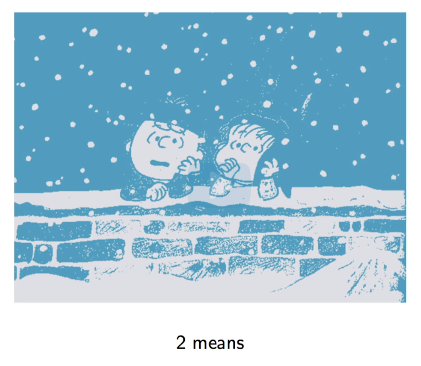

Or 4

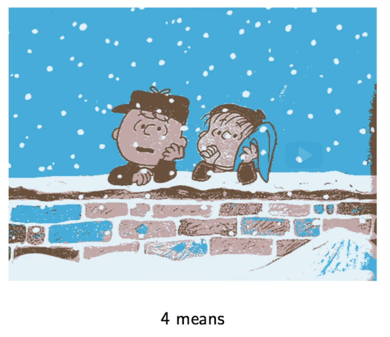

#### Clustering Definition
Input
$$
S_n = \{x^{(i)}| i=1..n\},K
$$
Output would be partitions
$$
C_1, C_2,.. C_k;\ U\ C_j=\{i...n\}
$$
Representation will be vectors which represents every single partition
$$
z^{(1)}\ z^{(k)}
$$

#### Similarity Measures-Cost functions
Lets say we want to divide into two clusters, but how do we know which one is better. We need to assign a cost to every possibility.

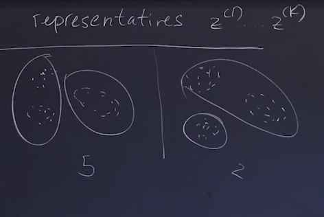

We have to calculate the sum of the cost for every cost
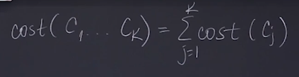

For individual cost we have may options, for example
* Diameter
* Average Distance
* $cost(C, z) = \sum_{i e C} dist(x^{i}, z)$
    * Cosine similarity

    

        * This is not sensible to vector magnitudes

    * Euclidean distance

    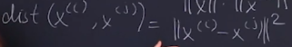

        * This is sensible to vector magnitude    
        * We can calculate the cost as

    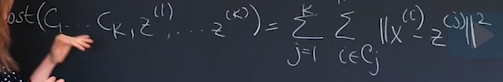

#### The K-Means Algorithm: The Big Picture
The broad steps are 
* Randomly select the representative. In the next case we select randomly 3 representatives 

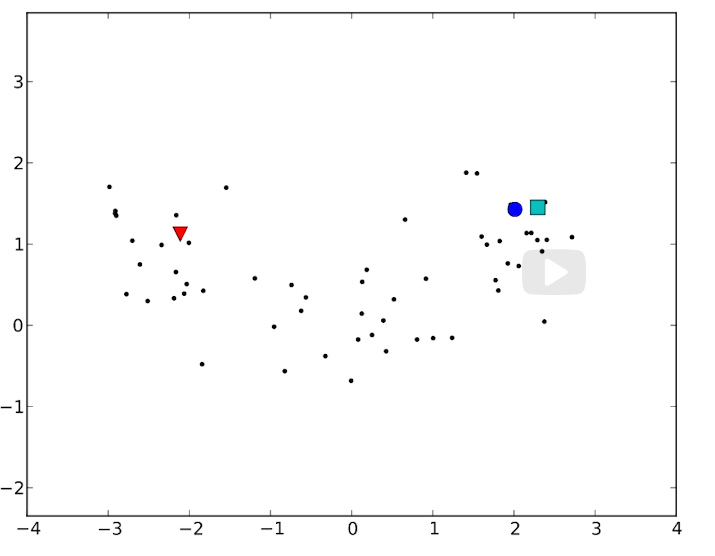

* Assign every point to the closest representative

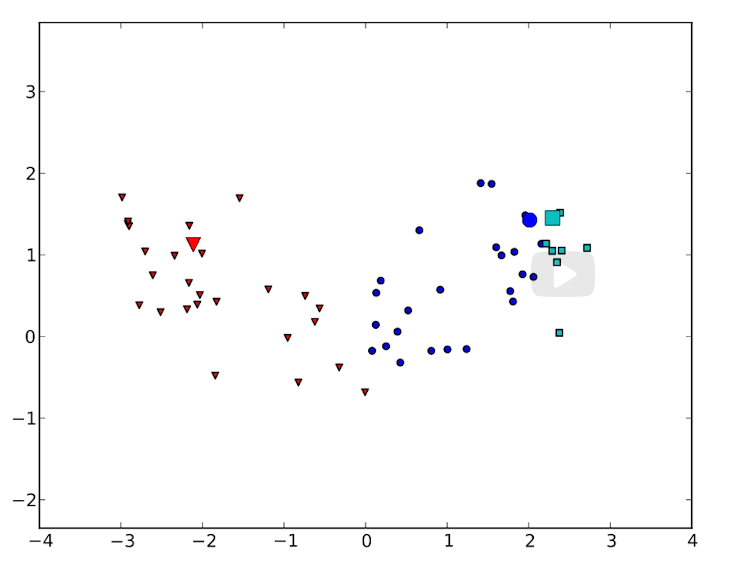

* Then we move the representatives to the cluster center

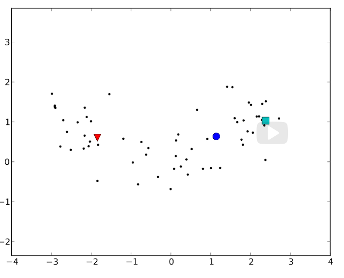

* Then assign againg the clusters

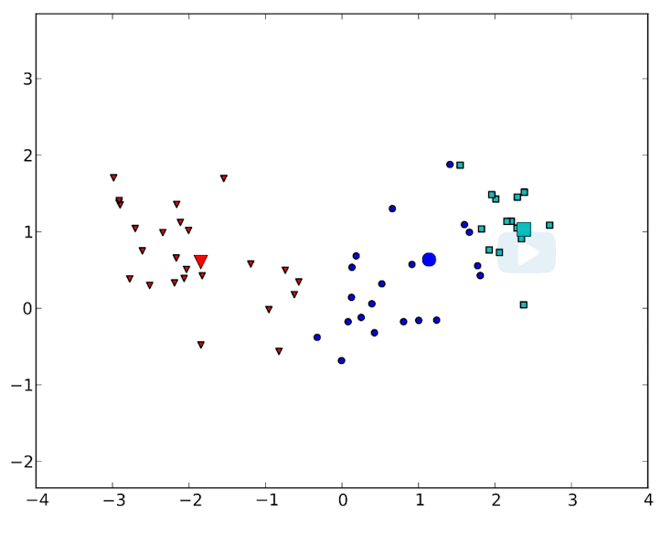

* And the same until convergence

As as a summary

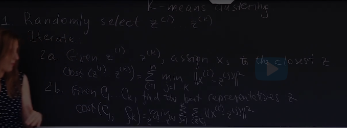

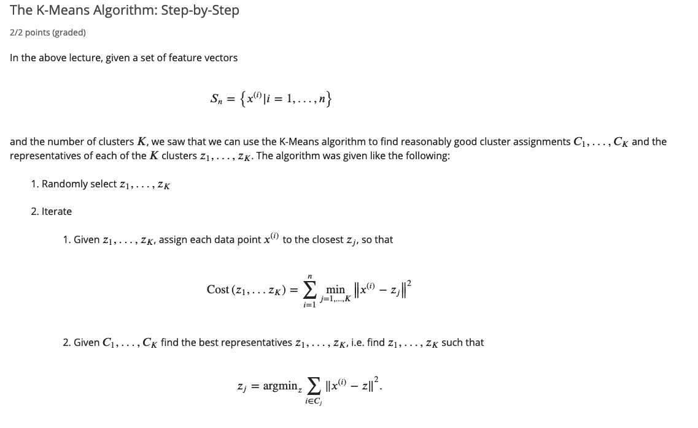

#### The K-Means Algorithm: The Specifics
To find the representative

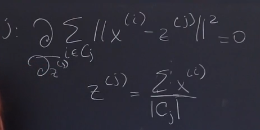

Note: Convergence happens locally

Impact of Initialization

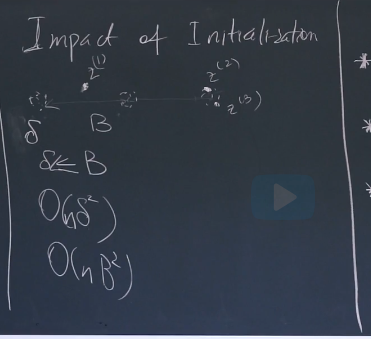

### Clustering Lecture 2
* Understand the limitations of the K-Means algorithm
* Understand how K-medoid algorithm is different from the K-Means algorithm
* Understand the computational complexity of the K-Meas and the K-Medoids algorithms
* Understand the imprtance of coosing the right number of clusters
* Understand elements than can be supervised in unsupervised learning

#### Limitations of the K Means Algorithm

* The first significant limitation of the algorith is the fact that the z's are actually not guraranteed to be the members of the original set of points x.
* In many application you wantt to work with other functions not necessarily with wquare Euclidean distance.

#### K-Medoids

The only difference is that now we select our representatives from the cluster. The representative would be the point closest to the other points. 

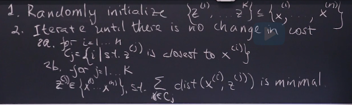

#### Computational Complexity of K-Means and K-Medoids

* K-Means
$$
O(n k d)
$$
* K-Medoids
$$
O(n^2 k d)
$$

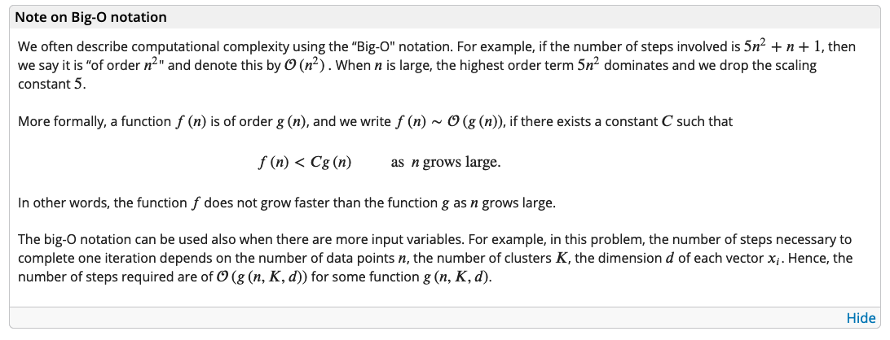

#### Determining the Number of Clusters

Some cases we can intuitively choose K, but in other cases we can look at the cost, or add other metrics to know how well the K performs

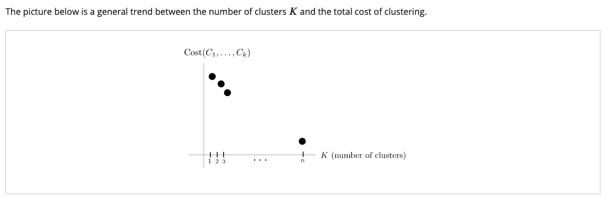

### Generative Models

* Understand what Generative Models are and how they work
* Understand estimation and prediction phases of generative models
* Derive a relation connecting generative and discriminative models
* Derive Maximum Likelihood Estimates (MLE) for multinomial and Gaussian generative models 

#### Generative vs Discriminative models

* Analize the structure of the data, not just discriminate it
* Generative models model the probability distribution of each class
* Discriminative models learn teh decision boundary between classes 

There are two kinds of generative models
* Multinomials
* Gaussians

Two questions in order to model 
1. How do we stimate the model?
2. How  actually do the prediction?

#### Simple Multinomial Generative model
* They will generate documents
* Documents that will be generated will have certain characteristics
    * Fixed vocabulary
    * Generate one word at the time
    * Words are independent of each other

* What kind of parameters?
    * $$P(W|\theta) = \theta_w $$ 
    * $$\theta_w \gt \sum_{w e W} \theta_w =1 $$

#### Likelihood Function
For  
D -> Document

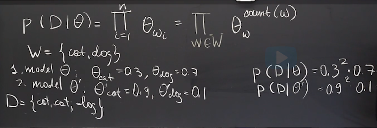

#### Maximun Likelihood Estimate

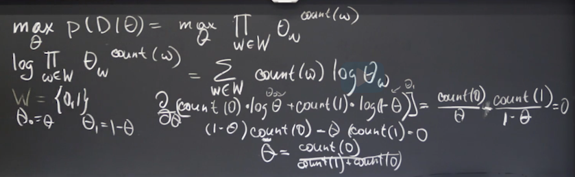

#### MLE for Multinomial Distribution 

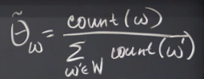

#### Prediction

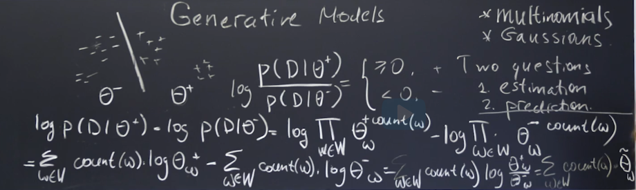

#### Prior, Posterior and Likelihood

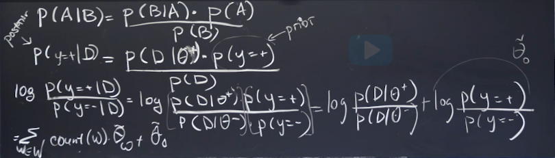

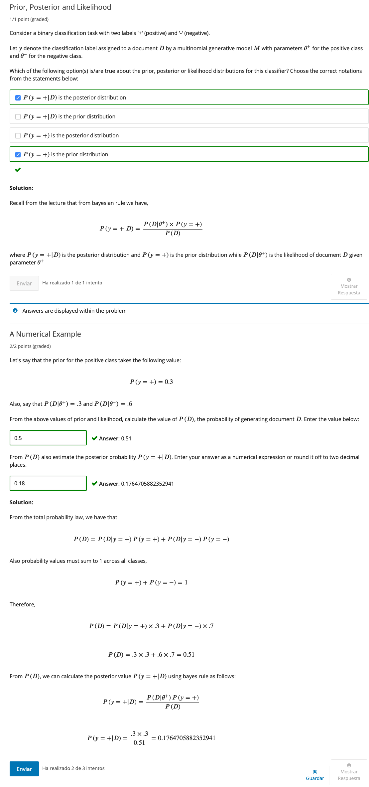

#### Gaussian Generative Models

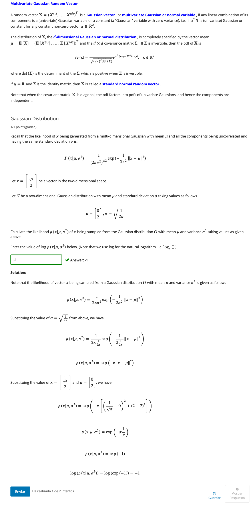

#### MLEs for Gaussian Distribution

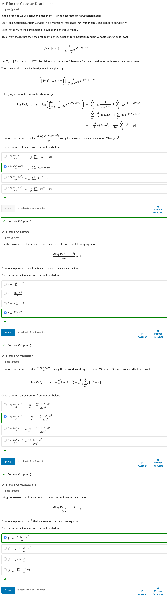

### Mixture Models and the Expectation Maximization (EM) Algorithm

* Review Maximum Likelihood Estimation (MLE) of mean and variance in Gaussian statistical model
* Define Mixture Models
* Understand and derive ML estimates of mean and variance of Gaussians in an Observed Gaussian Mixture Model
* Understand Expectation Maximization (EM) algorithm to estimate mean and variance of Gaussians in an Unobserved Gaussian Mixture Model 

#### Recap of Maximun Likelihood Estimation for Multinomial and Gaussian Models

 So far, in clustering we have assumed that the data has no probabilistic generative model attached to it, and we have used various iterative algorithms based on similarity measures to come up with a way to group similar data points into clusters. In this lecture, we will assume an underlying probabilistic generative model that will lead us to a natural clustering algorithm called the EM algorithm .

While a “hard" clustering algorithm like k-means or k-medoids can only provide a cluster ID for each data point, the EM algorithm, along with the generative model driving its equations, can provide the posterior probability (“soft" assignments) that every data point belongs to any cluster. 

#### Introduction to Mixture Models

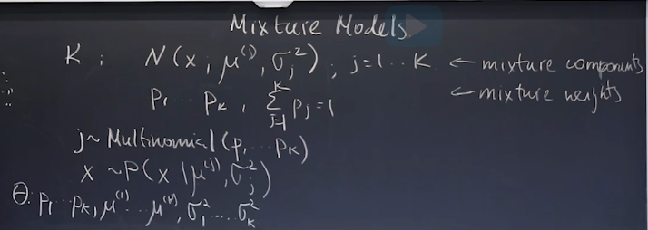

#### Likelihood of Gaussian Mixture Model

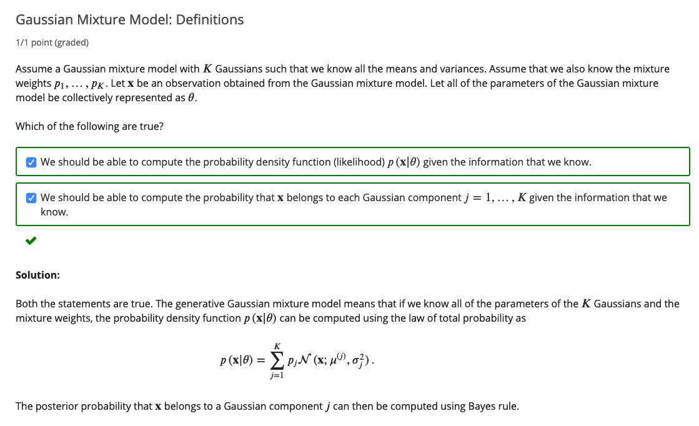

#### Mixture Model - Observed Case

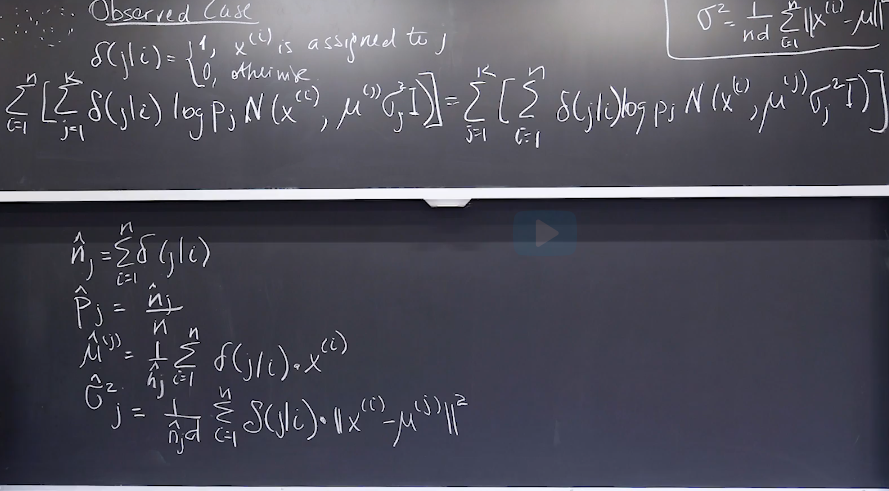

#### Misture Model - Unobserved Case: EM Algorithm

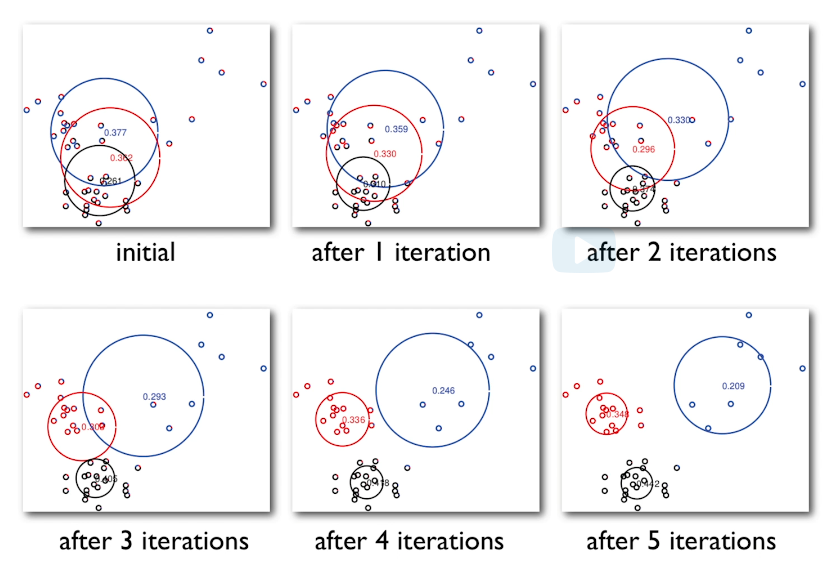

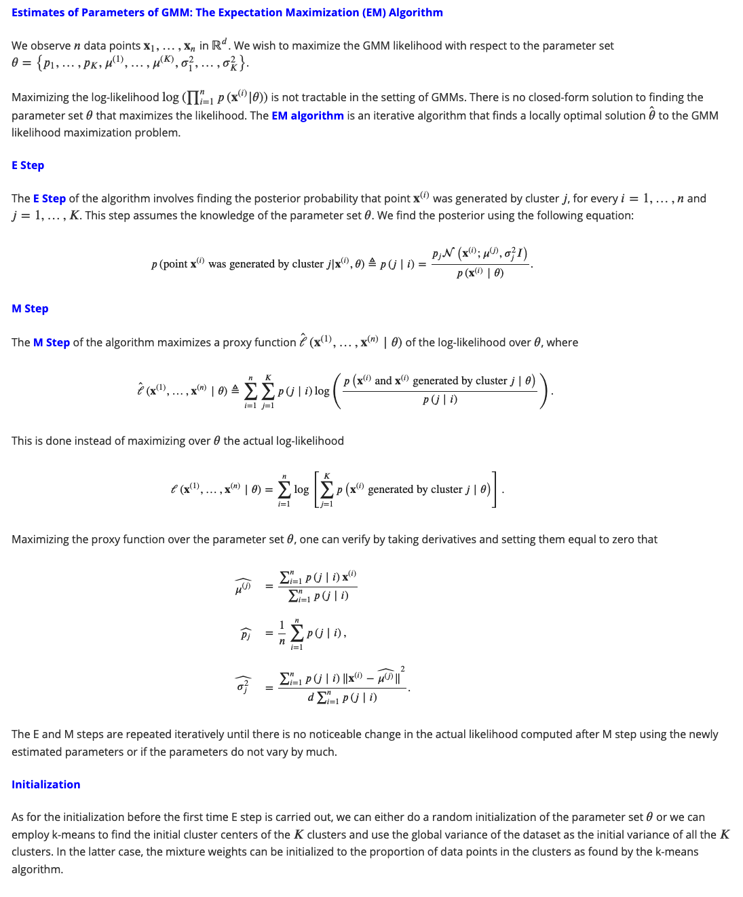
